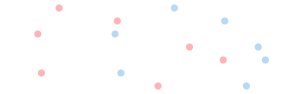
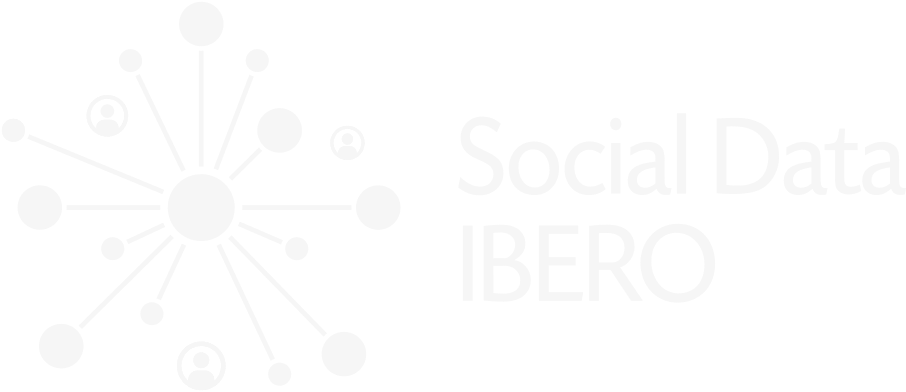
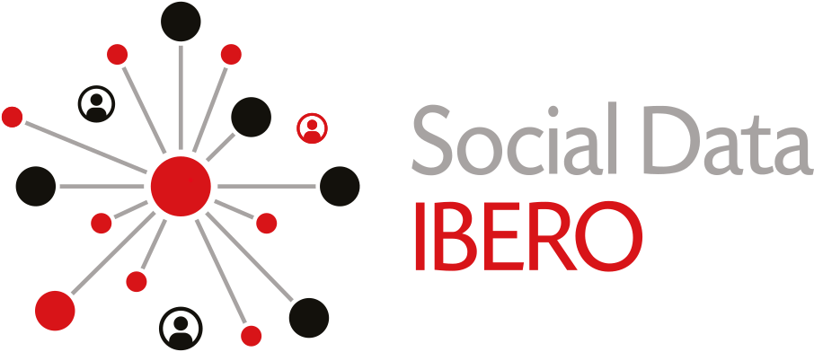

<div class="book-hero">
  <div class="book-hero-content">
    <span class="book-hero-eyebrow">Tablero de datos de Social Data Ibero</span>
    <h1 class="book-hero-title">Grupos originarios: dónde viven y cómo se conectan</h1>
    <p class="book-hero-subtitle">El mapa por manzana de la Ciudad de México y el acceso a internet, celular y computadora en el país</p>
    <p class="book-hero-abstract">Este tablero reúne dos trabajos sobre la población indígena de México: el mapa por manzana de la Ciudad de México, con el Censo 2020, y el acceso a internet, celular y computadora comparado con el resto de la población, con el Censo, la ENIGH y la ENDUTIH.</p>
    <div class="book-hero-ctas">
      <a class="book-cta book-cta-primary" href="./mapa-manzanas">Abrir el mapa por manzana</a>
      <a class="book-cta" href="./encuestas/endutih/uso">Ver el acceso digital</a>
    </div>
  </div>

<div class="book-cover">
  <div class="book-cover-inner">
  <div class="book-cover-accent"><span class="book-cover-accent-shimmer"></span></div>
<div class="book-cover-brillo" aria-hidden="true"></div>
  
  <div class="book-cover-text">
  <span class="book-cover-eyebrow">Social Data Ibero</span>
  <span class="book-cover-title">Grupos originarios</span>
  <span class="book-cover-subtitle">Población indígena de México: dónde vive y cómo se conecta</span>
</div>
  <span class="book-cover-year">MMXXVI · 2026</span>
  
</div>
</div>
</div>

<div class="instituciones-fila instituciones-fila--hero">
  <span class="instituciones-eyebrow">Un proyecto de</span>
  <a class="instituciones-chip instituciones-chip--ibero" href="https://ibero.mx" target="_blank" rel="noopener"></a>
  <a class="instituciones-chip instituciones-chip--sdie" href="https://socialdata.ibero.mx" target="_blank" rel="noopener"></a>
</div>

<section class="book-meta-grid" aria-label="Información editorial">
  <div class="book-meta-field book-meta-field--wide">
    <span class="book-meta-label">Autores</span>
    <ul class="book-authors">
      <li>Misael Saúl Avila López <a href="https://orcid.org/0009-0003-9606-354X" target="_blank" rel="noopener" aria-label="ORCID de Misael Saúl Avila López"></a></li>
      <li>Dr. Wilfrido Gómez Arias <a href="https://orcid.org/0009-0002-2406-8555" target="_blank" rel="noopener" aria-label="ORCID de Wilfrido Gómez Arias"></a> <a href="mailto:wilfrido.gomez@ibero.mx" aria-label="Correo de Wilfrido Gómez Arias (autor de correspondencia)"><svg class="mail-icon" viewBox="0 0 24 24" fill="none" stroke="currentColor" stroke-width="2" stroke-linecap="round" stroke-linejoin="round" aria-hidden="true"><path d="M4 5h16a2 2 0 0 1 2 2v10a2 2 0 0 1-2 2H4a2 2 0 0 1-2-2V7a2 2 0 0 1 2-2z"/><polyline points="22,7 12,14 2,7"/></svg></a></li>
    </ul>
  </div>
  <div class="book-meta-field">
    <span class="book-meta-label">Afiliación</span>
    <span class="book-meta-value">Social Data Ibero</span>
    <span class="book-meta-sub">Universidad Iberoamericana, Ciudad de México</span>
  </div>
  <div class="book-meta-field">
    <span class="book-meta-label">Año</span>
    <span class="book-meta-value">2026</span>
  </div>
  <div class="book-meta-field">
    <span class="book-meta-label">Fuentes</span>
    <span class="book-meta-value">INEGI</span>
    <span class="book-meta-sub">Censo 2020 · ENIGH 2020 - 2024 · ENDUTIH 2025 · Marco Geoestadístico</span>
  </div>
  <div class="book-meta-field">
    <span class="book-meta-label">DOI</span>
    <span class="book-meta-value book-meta-placeholder">por asignar</span>
  </div>
  <div class="book-meta-field">
    <span class="book-meta-label">Licencia</span>
    <span class="book-meta-value book-meta-placeholder">por definir</span>
  </div>
</section>

<section id="citar" class="book-citation" aria-label="Cómo citar este tablero">
  <header class="book-citation-header">
    <h2>Cómo citar este tablero</h2>
    <p>Selecciona el formato que usa tu publicación.</p>
  </header>
  <div class="book-citation-tabs" role="tablist">
    <button type="button" role="tab" aria-selected="true" aria-controls="cite-apa" id="tab-apa" class="book-citation-tab is-active">APA 7</button>
    <button type="button" role="tab" aria-selected="false" aria-controls="cite-chicago" id="tab-chicago" class="book-citation-tab">Chicago</button>
    <button type="button" role="tab" aria-selected="false" aria-controls="cite-ieee" id="tab-ieee" class="book-citation-tab">IEEE</button>
    <button type="button" role="tab" aria-selected="false" aria-controls="cite-bibtex" id="tab-bibtex" class="book-citation-tab">BibTeX</button>
  </div>

  <div class="book-citation-panel is-active" id="cite-apa" role="tabpanel" aria-labelledby="tab-apa">
    <div class="book-citation-text">Avila López, M. S., &amp; Gómez Arias, W. (2026). <em>Grupos originarios: el acceso digital de la población indígena de México</em>. Social Data Ibero, Universidad Iberoamericana.</div>
    <button type="button" class="book-citation-copy" data-copy-target="#cite-apa .book-citation-text" aria-label="Copiar cita en formato APA 7">Copiar</button>
  </div>

  <div class="book-citation-panel" id="cite-chicago" role="tabpanel" aria-labelledby="tab-chicago" hidden>
    <div class="book-citation-text">Avila López, Misael Saúl y Wilfrido Gómez Arias. <em>Grupos originarios: el acceso digital de la población indígena de México</em>. Ciudad de México: Social Data Ibero, Universidad Iberoamericana, 2026.</div>
    <button type="button" class="book-citation-copy" data-copy-target="#cite-chicago .book-citation-text" aria-label="Copiar cita en formato Chicago">Copiar</button>
  </div>

  <div class="book-citation-panel" id="cite-ieee" role="tabpanel" aria-labelledby="tab-ieee" hidden>
    <div class="book-citation-text">M. S. Avila López y W. Gómez Arias, <em>Grupos originarios: el acceso digital de la población indígena de México</em>. Ciudad de México: Social Data Ibero, Universidad Iberoamericana, 2026. [En línea].</div>
    <button type="button" class="book-citation-copy" data-copy-target="#cite-ieee .book-citation-text" aria-label="Copiar cita en formato IEEE">Copiar</button>
  </div>

  <div class="book-citation-panel book-citation-panel--code" id="cite-bibtex" role="tabpanel" aria-labelledby="tab-bibtex" hidden>
    <pre class="book-citation-bibtex"><code>@misc{avila2026gruposoriginarios,
  title     = {Grupos originarios: el acceso digital de la poblaci{\'o}n ind{\'i}gena de M{\'e}xico},
  author    = {Avila L{\'o}pez, Misael Sa{\'u}l and G{\'o}mez Arias, Wilfrido},
  year      = {2026},
  publisher = {Social Data Ibero, Universidad Iberoamericana},
  address   = {Ciudad de M{\'e}xico},
  howpublished = {Tablero de datos}
}</code></pre>
    <button type="button" class="book-citation-copy book-citation-copy--code" data-copy-target="#cite-bibtex code" aria-label="Copiar entrada BibTeX">Copiar</button>
  </div>

  <div class="book-citation-feedback" role="status" aria-live="polite"></div>
</section>

```js
import {materializar} from "./components/agregar.js";
import {prepararSeries, brechaDe} from "./components/filtros.js";
import {dumbbell, kpis, figura, explicacion, tablaDatos, seccion} from "./components/graficas.js";
import {conDescarga} from "./components/descargar.js";
import {anchoActual, alCambiarAncho, alCambiarModo, formatear, TODOS} from "./components/base.js";
import {ENCUESTAS} from "./components/catalogo.js";

const censo = materializar(await FileAttachment("./data/indicadores/censo-vivienda.parquet").parquet());
const enigh = materializar(await FileAttachment("./data/indicadores/enigh-hogar.parquet").parquet());
const endutih = materializar(await FileAttachment("./data/indicadores/endutih-uso.parquet").parquet());
```

```js
// Resumen nacional de cada indicador clave, bajo el criterio de lengua, con
// todas las entidades, edades y localidades juntas. La capa principal de cada
// archivo trae decil y escolaridad en "Todos".
const nacional = (filas, indicador) => prepararSeries(
  filas.filter((d) => d.indicador === indicador && d.decil === TODOS && d.escolaridad === TODOS),
  {comparacion: "indigena", criterio: "lengua", dims: []});

const CLAVE = [
  {fuente: "Censo 2020", filas: censo, indicador: "Vive en una vivienda con internet", corto: "Vive en una vivienda con internet (Censo 2020)"},
  {fuente: "ENIGH 2024", filas: enigh.filter((d) => d.anio === 2024), indicador: "Vive en un hogar con conexión a internet", corto: "Vive en un hogar con internet (ENIGH 2024)"},
  {fuente: "ENIGH 2024", filas: enigh.filter((d) => d.anio === 2024), indicador: "Vive en un hogar con computadora o laptop", corto: "Vive en un hogar con computadora (ENIGH 2024)"},
  {fuente: "ENDUTIH 2025", filas: endutih, indicador: "Usa internet", corto: "Usa internet (ENDUTIH 2025)"},
  {fuente: "ENDUTIH 2025", filas: endutih, indicador: "Usa celular", corto: "Usa celular (ENDUTIH 2025)"},
  {fuente: "ENDUTIH 2025", filas: endutih, indicador: "Usa computadora, laptop o tableta", corto: "Usa computadora (ENDUTIH 2025)"},
  {fuente: "ENDUTIH 2025", filas: endutih, indicador: "Vive en un hogar con internet", corto: "Vive en un hogar con internet (ENDUTIH 2025)"},
];
const resumen = CLAVE.flatMap((c) => nacional(c.filas, c.indicador).map((s) => ({...s, indicador: c.corto})));
const usa = nacional(endutih, "Usa internet");
const brechaUsa = brechaDe(usa, "indigena");
const viv = nacional(censo, "Vive en una vivienda con internet");
const brechaViv = brechaDe(viv, "indigena");
const serie2020 = nacional(enigh.filter((d) => d.anio === 2020), "Vive en un hogar con conexión a internet");
const serie2024 = nacional(enigh.filter((d) => d.anio === 2024), "Vive en un hogar con conexión a internet");
const ind20 = serie2020.find((s) => s.serie === "Población indígena")?.pct;
const ind24 = serie2024.find((s) => s.serie === "Población indígena")?.pct;
const b20 = brechaDe(serie2020, "indigena"), b24 = brechaDe(serie2024, "indigena");
```

```js
display(kpis([
  {etiqueta: "Brecha en uso de internet", cifra: brechaUsa ? brechaUsa.texto : "s/d",
   nota: "ENDUTIH 2025, personas de 6 años o más, criterio de lengua"},
  {etiqueta: "Brecha en internet en la vivienda", cifra: brechaViv ? brechaViv.texto : "s/d",
   nota: "Censo 2020, personas de 6 años o más, criterio de lengua"},
  {etiqueta: "Brecha en internet en el hogar", cifra: b24 ? b24.texto : "s/d",
   nota: "ENIGH 2024, personas de 6 años o más, criterio de lengua"},
]));
```

---

<h2 id="brecha" class="toc-anchor">La brecha en cada fuente</h2>

```js
display(seccion({numero: "01", titulo: "La brecha en cada fuente"}));
```

```js
{
  const cuerpo = html`<div class="seccion-cuerpo"></div>`;
  let ancho = anchoActual();
  const pintar = () => {
    cuerpo.replaceChildren(
      conDescarga(figura({
        titulo: "Población indígena y resto de la población en los indicadores centrales",
        subtitulo: "Habla lengua indígena. Todo el país, todas las edades. Cada fuente con su propia edición y su propia unidad.",
        pie: "INEGI (Censo 2020, ENIGH 2024, ENDUTIH 2025): cada fila es un indicador, los dos puntos las proporciones de cada grupo y el segmento la brecha.",
      }, [dumbbell(resumen, {comparacion: "indigena", filas: "indicador", etiquetaFilas: "Indicador", ordenarPorBrecha: true, width: ancho, alturaFila: 36})])),
      explicacion(`Cada indicador se calcula sobre las personas de 6 años o más de cada grupo, con el
        criterio de lengua: población indígena es quien declaró hablar alguna lengua indígena. El
        Censo y la ENIGH miden lo que hay en la vivienda o el hogar; la ENDUTIH lo que la persona
        usa. Las páginas de cada fuente permiten cambiar el criterio a autoadscripción y desglosar
        por entidad, sexo, edad, localidad, ingreso y escolaridad.`),
      tablaDatos(resumen, {dims: ["indicador"]}),
    );
  };
  alCambiarAncho((n) => { ancho = n; pintar(); });
  alCambiarModo(() => pintar());
  pintar();
  display(cuerpo);
}
```

---

<h2 id="explorar" class="toc-anchor">Explorar por fuente</h2>

```js
display(seccion({numero: "02", titulo: "Explorar por fuente"}));
```

```js
{
  const t = html`<div class="grid grid-cols-2"></div>`;
  t.append(html`<div class="card"><span class="card-numero" aria-hidden="true">01</span>
    <h3><a href="./mapa-manzanas">Mapa por manzana de la Ciudad de México</a></h3>
    <p>Dónde vive la población en hogares indígenas de la ciudad, manzana por manzana, con el Censo 2020 y los pueblos originarios señalados.</p></div>`);
  t.append(html`<div class="card"><span class="card-numero" aria-hidden="true">02</span>
    <h3><a href="./mapa-agebs">Mapa por AGEB</a></h3>
    <p>Presencia indígena, conectividad de las viviendas, marginación urbana y rezago social por AGEB, con un umbral a elección.</p></div>`);
  ENCUESTAS.forEach((c, i) => t.append(html`<div class="card"><span class="card-numero" aria-hidden="true">0${i + 3}</span>
    <h3><a href=".${c.ruta}">${c.nombre}</a></h3>
    <p>${c.resumen}</p></div>`));
  display(t);
}
```

---

<h2 id="ciudad" class="toc-anchor">La Ciudad de México, colonia por colonia</h2>

```js
display(seccion({numero: "03", titulo: "La Ciudad de México, colonia por colonia"}));
```

```js
// Se lee el CSV sin geometría y no el GeoJSON: aquí solo se grafican
// propiedades, y las geometrías costaban 5.4 MB de descarga para no dibujarse.
const props = (await FileAttachment("./data/colonias_resumen.csv").csv({typed: true}))
  .filter((p) => p.POBTOT >= 500);
import * as Plot from "npm:@observablehq/plot";
import {resize} from "observablehq:stdlib";
// Promedio de la ciudad: la fila de TOTAL DE LA ENTIDAD del tabulado del Censo
// (289,139 personas en hogares indígenas de 9,209,944 habitantes). Antes se
// usaba la suma de las manzanas con cifra publicada (273,851 de 9,145,155),
// que deja fuera lo suprimido por confidencialidad y lo rural.
const pobTotal = 9209944;
const indTotal = 289139;
```

<div class="grid grid-cols-2 rejilla-figuras">
<div class="bloque-indicador">

```js
display(conDescarga(figura({
  titulo: "Cuántas colonias tienen cada porcentaje de población en hogares indígenas",
  subtitulo: "Colonias de 500 habitantes o más. La línea marca el promedio de la ciudad.",
  pie: "Censo 2020, tabulado por manzana: cada barra cuenta colonias con ese porcentaje de su población en hogares censales indígenas.",
}, [resize((width) => Plot.plot({
  width, height: 260, style: {fontSize: "13px"}, marginLeft: 55,
  x: {label: "% de la población de la colonia en hogares indígenas", grid: true},
  y: {label: "colonias", grid: true},
  marks: [
    Plot.rectY(props, Plot.binX({y: "count"}, {x: "tasa_phog_ind", fill: "#2166AC", thresholds: 40, rx2: 3,
      tip: true})),
    Plot.ruleX([indTotal / pobTotal * 100], {stroke: "#C4101B", strokeWidth: 2}),
    Plot.ruleY([0]),
  ],
}))])));
```

<details class="explica-analisis">
<summary>¿Qué quiere decir este análisis?</summary>
<p>Cada barra cuenta cuántas colonias tienen determinado porcentaje de su población en hogares censales indígenas. El denominador es la población total de cada colonia, y se excluyen las de menos de 500 habitantes. La línea roja marca el promedio de la ciudad. El detalle vive en el mapa por manzana.</p>
</details>

</div>
<div class="bloque-indicador">

```js
display(conDescarga(figura({
  titulo: "Pueblos originarios y resto de la ciudad",
  subtitulo: "Cada punto es una colonia de 500 habitantes o más; la línea punteada es el promedio de la ciudad.",
  pie: "Censo 2020 y padrón de la SEPI: población de la colonia (escala logarítmica) contra su porcentaje en hogares indígenas.",
}, [resize((width) => Plot.plot({
  width, height: 260, style: {fontSize: "13px"}, marginLeft: 60,
  x: {label: "población de la colonia", type: "log", grid: true},
  y: {label: "% en hogares indígenas", grid: true},
  color: {legend: true, domain: ["Pueblo o barrio originario", "Resto de la ciudad"], range: ["#C4101B", "#2166AC"]},
  marks: [
    Plot.dot(props, {x: "POBTOT", y: "tasa_phog_ind",
      fill: (d) => (d.pueblo_originario ? "Pueblo o barrio originario" : "Resto de la ciudad"),
      r: 3, fillOpacity: 0.7, tip: true, channels: {Colonia: "colonia", Alcaldía: "alcaldia_col"}}),
    Plot.ruleY([indTotal / pobTotal * 100], {stroke: "#C4101B", strokeWidth: 1.5, strokeDasharray: "4 3"}),
    Plot.ruleY([0]),
  ],
}))])));
```

<details class="explica-analisis">
<summary>¿Qué quiere decir este análisis?</summary>
<p>El eje horizontal es la población de cada colonia en escala logarítmica; el vertical, el porcentaje de esa población en hogares censales indígenas. Los puntos rojos son las colonias que se solapan con un pueblo o barrio originario del padrón de la Ciudad de México.</p>
</details>

</div>
</div>

```js
// Pestañas de la cita y botón de copiar: controles de presentación, no filtros
// de datos, así que van como DOM directo.
{
  const tabs = document.querySelectorAll(".book-citation-tab");
  const paneles = document.querySelectorAll(".book-citation-panel");
  for (const t of tabs) t.addEventListener("click", () => {
    for (const x of tabs) { x.classList.toggle("is-active", x === t); x.setAttribute("aria-selected", String(x === t)); }
    for (const p of paneles) { const activo = p.id === t.getAttribute("aria-controls"); p.classList.toggle("is-active", activo); p.hidden = !activo; }
  });
  const aviso = document.querySelector(".book-citation-feedback");
  for (const b of document.querySelectorAll(".book-citation-copy")) b.addEventListener("click", async () => {
    const texto = document.querySelector(b.dataset.copyTarget)?.textContent?.trim() ?? "";
    try { await navigator.clipboard.writeText(texto); if (aviso) aviso.textContent = "Cita copiada al portapapeles."; }
    catch { if (aviso) aviso.textContent = "No se pudo copiar; selecciona el texto y cópialo a mano."; }
  });
}
```
