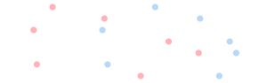
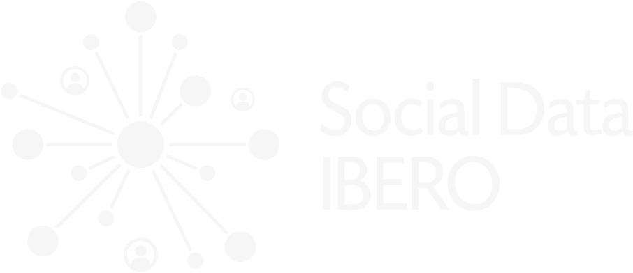
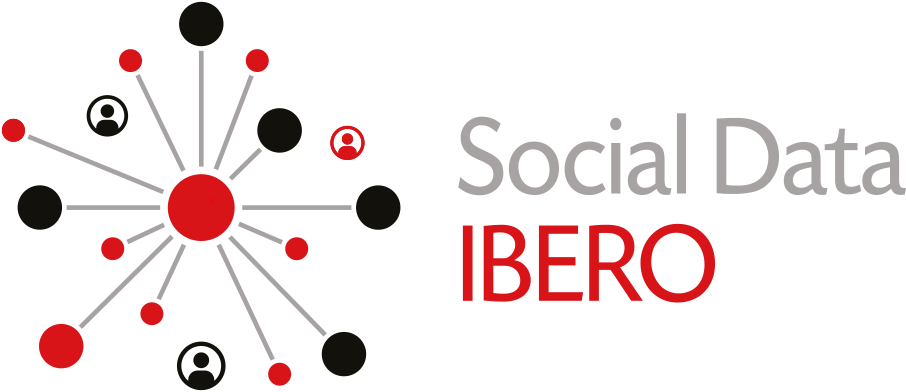

<div class="book-hero">
  <div class="book-hero-content">
    <span class="book-hero-eyebrow">Tablero de datos de Social Data Ibero</span>
    <h1 class="book-hero-title">Grupos originarios: dónde vive la población indígena de la Ciudad de México</h1>
    <p class="book-hero-subtitle">Hablantes, hogares indígenas y autoadscripción por alcaldía, AGEB y manzana, de 1990 a 2025; las lenguas, sus variantes probables y de dónde vienen quienes las hablan</p>
    <p class="book-hero-abstract">Este tablero reúne los censos, conteos y encuestas intercensales del INEGI de 1990 a 2025 para describir la distribución de la población indígena en la Ciudad de México: cuánta es según tres definiciones, dónde vive, qué lenguas habla, de qué entidades llegó y qué variante es probable que hable según el Catálogo del INALI.</p>
    <div class="book-hero-ctas">
      <a class="book-cta book-cta-primary" href="./mapa">Abrir el mapa</a>
      <a class="book-cta" href="./metodologia/paso-a-paso">Cómo se hizo, paso a paso</a>
    </div>
  </div>

<div class="book-cover">
  <div class="book-cover-inner">
  <div class="book-cover-accent"><span class="book-cover-accent-shimmer"></span></div>
<div class="book-cover-brillo" aria-hidden="true"></div>
  
  <div class="book-cover-text">
  <span class="book-cover-eyebrow">Social Data Ibero</span>
  <span class="book-cover-title">Grupos originarios</span>
  <span class="book-cover-subtitle">Población indígena de la Ciudad de México: dónde vive y qué lenguas habla</span>
</div>
  <span class="book-cover-year">MMXXVI · 2026</span>
  
</div>
</div>
</div>

<div class="instituciones-fila instituciones-fila--hero">
  <span class="instituciones-eyebrow">Un proyecto de</span>
  <a class="instituciones-chip instituciones-chip--ibero" href="https://ibero.mx" target="_blank" rel="noopener"></a>
  <a class="instituciones-chip instituciones-chip--sdie" href="https://socialdata.ibero.mx" target="_blank" rel="noopener"></a>
</div>

<section class="book-meta-grid" aria-label="Información editorial">
  <div class="book-meta-field book-meta-field--wide">
    <span class="book-meta-label">Autores</span>
    <ul class="book-authors">
      <li>Misael Saúl Avila López <a href="https://orcid.org/0009-0003-9606-354X" target="_blank" rel="noopener" aria-label="ORCID de Misael Saúl Avila López"></a></li>
      <li>Dr. Wilfrido Gómez Arias <a href="https://orcid.org/0009-0002-2406-8555" target="_blank" rel="noopener" aria-label="ORCID de Wilfrido Gómez Arias"></a> <a href="mailto:wilfrido.gomez@ibero.mx" aria-label="Correo de Wilfrido Gómez Arias (autor de correspondencia)"><svg class="mail-icon" viewBox="0 0 24 24" fill="none" stroke="currentColor" stroke-width="2" stroke-linecap="round" stroke-linejoin="round" aria-hidden="true"><path d="M4 5h16a2 2 0 0 1 2 2v10a2 2 0 0 1-2 2H4a2 2 0 0 1-2-2V7a2 2 0 0 1 2-2z"/><polyline points="22,7 12,14 2,7"/></svg></a></li>
    </ul>
  </div>
  <div class="book-meta-field">
    <span class="book-meta-label">Afiliación</span>
    <span class="book-meta-value">Social Data Ibero</span>
    <span class="book-meta-sub">Universidad Iberoamericana, Ciudad de México</span>
  </div>
  <div class="book-meta-field">
    <span class="book-meta-label">Año</span>
    <span class="book-meta-value">2026</span>
  </div>
  <div class="book-meta-field">
    <span class="book-meta-label">Fuentes</span>
    <span class="book-meta-value">INEGI · INALI · CONAPO · CONEVAL</span>
    <span class="book-meta-sub">Censos 1990 - 2020 · Conteos 1995 y 2005 · Intercensales 2015 y 2025 · Catálogo de Lenguas 2008</span>
  </div>
  <div class="book-meta-field">
    <span class="book-meta-label">DOI</span>
    <span class="book-meta-value book-meta-placeholder">por asignar</span>
  </div>
  <div class="book-meta-field">
    <span class="book-meta-label">Licencia</span>
    <span class="book-meta-value book-meta-placeholder">por definir</span>
  </div>
</section>

<section id="citar" class="book-citation" aria-label="Cómo citar este tablero">
  <header class="book-citation-header">
    <h2>Cómo citar este tablero</h2>
    <p>Selecciona el formato que usa tu publicación.</p>
  </header>
  <div class="book-citation-tabs" role="tablist">
    <button type="button" role="tab" aria-selected="true" aria-controls="cite-apa" id="tab-apa" class="book-citation-tab is-active">APA 7</button>
    <button type="button" role="tab" aria-selected="false" aria-controls="cite-chicago" id="tab-chicago" class="book-citation-tab">Chicago</button>
    <button type="button" role="tab" aria-selected="false" aria-controls="cite-ieee" id="tab-ieee" class="book-citation-tab">IEEE</button>
    <button type="button" role="tab" aria-selected="false" aria-controls="cite-bibtex" id="tab-bibtex" class="book-citation-tab">BibTeX</button>
  </div>

  <div class="book-citation-panel is-active" id="cite-apa" role="tabpanel" aria-labelledby="tab-apa">
    <div class="book-citation-text">Avila López, M. S., &amp; Gómez Arias, W. (2026). <em>Grupos originarios: la población indígena de la Ciudad de México, 1990 - 2025</em>. Social Data Ibero, Universidad Iberoamericana.</div>
    <button type="button" class="book-citation-copy" data-copy-target="#cite-apa .book-citation-text" aria-label="Copiar cita en formato APA 7">Copiar</button>
  </div>

  <div class="book-citation-panel" id="cite-chicago" role="tabpanel" aria-labelledby="tab-chicago" hidden>
    <div class="book-citation-text">Avila López, Misael Saúl y Wilfrido Gómez Arias. <em>Grupos originarios: la población indígena de la Ciudad de México, 1990 - 2025</em>. Ciudad de México: Social Data Ibero, Universidad Iberoamericana, 2026.</div>
    <button type="button" class="book-citation-copy" data-copy-target="#cite-chicago .book-citation-text" aria-label="Copiar cita en formato Chicago">Copiar</button>
  </div>

  <div class="book-citation-panel" id="cite-ieee" role="tabpanel" aria-labelledby="tab-ieee" hidden>
    <div class="book-citation-text">M. S. Avila López y W. Gómez Arias, <em>Grupos originarios: la población indígena de la Ciudad de México, 1990 - 2025</em>. Ciudad de México: Social Data Ibero, Universidad Iberoamericana, 2026. [En línea].</div>
    <button type="button" class="book-citation-copy" data-copy-target="#cite-ieee .book-citation-text" aria-label="Copiar cita en formato IEEE">Copiar</button>
  </div>

  <div class="book-citation-panel book-citation-panel--code" id="cite-bibtex" role="tabpanel" aria-labelledby="tab-bibtex" hidden>
    <pre class="book-citation-bibtex"><code>@misc{avila2026gruposoriginarios,
  title     = {Grupos originarios: la poblaci{\'o}n ind{\'i}gena de la Ciudad de M{\'e}xico, 1990 - 2025},
  author    = {Avila L{\'o}pez, Misael Sa{\'u}l and G{\'o}mez Arias, Wilfrido},
  year      = {2026},
  publisher = {Social Data Ibero, Universidad Iberoamericana},
  address   = {Ciudad de M{\'e}xico},
  howpublished = {Tablero de datos}
}</code></pre>
    <button type="button" class="book-citation-copy book-citation-copy--code" data-copy-target="#cite-bibtex code" aria-label="Copiar entrada BibTeX">Copiar</button>
  </div>

  <div class="book-citation-feedback" role="status" aria-live="polite"></div>
</section>

```js
import {kpis, seccion, figura, explicacion} from "./components/graficas.js";
import {conDescarga} from "./components/descargar.js";
import {punto, COLOR_SERIE, alCambiarModo, alCambiarAncho, anchoActual, ejePct} from "./components/base.js";
import {procedencia} from "./components/fuentes.js";
import * as Plot from "npm:@observablehq/plot";

const fuenteDe = procedencia({fuentes: await FileAttachment("./data/fuentes.csv").csv(), verificaciones: await FileAttachment("./data/verificaciones.csv").csv(), calculado: await FileAttachment("./data/calculado.csv").csv()});
const serie = (await FileAttachment("./data/serie_alcaldias.csv").csv({typed: true})).map((r) => ({...r, anio: Number(r.anio)}));
const lenguas = (await FileAttachment("./data/lenguas_alcaldia.csv").csv({typed: true})).map((r) => ({...r, anio: Number(r.anio), lengua: String(r.lengua).padStart(4, "0")}));
const ciudad = (pob, anio) => serie.find((r) => r.nivel === "entidad" && r.sexo === "Total" && r.poblacion === pob && r.anio === anio);
const pct = (r) => (r ? `${(100 * r.num / r.den).toFixed(1)} %` : "s/d");
```

```js
// Tarjetas: las tres definiciones de población indígena en la edición más
// reciente, y cuántas lenguas registró la muestra. La nota dice solo el universo.
{
  const h = ciudad("hablantes5", 2025), a = ciudad("autoads", 2025), g = ciudad("hogares", 2025);
  const nLenguas = new Set(lenguas.filter((r) => r.anio === 2025 && r.nivel === "entidad" && r.lengua < "8000").map((r) => r.lengua)).size;
  display(kpis([
    {etiqueta: "Hablan una lengua indígena", cifra: pct(h), nota: `${punto(Math.round(h?.num ?? 0))} personas de 5 años y más, 2025`},
    {etiqueta: "Se consideran indígenas", cifra: pct(a), nota: `${punto(Math.round(a?.num ?? 0))} personas, 2025`},
    {etiqueta: "Viven en hogares indígenas", cifra: pct(g), nota: `${punto(Math.round(g?.num ?? 0))} personas, 2025`},
    {etiqueta: "Lenguas con hablantes en la ciudad", cifra: String(nLenguas), nota: "agrupaciones lingüísticas, Encuesta Intercensal 2025"},
  ]));
}
```

---

<h2 id="serie" class="toc-anchor">Treinta y cinco años de hablantes</h2>

```js
display(seccion({numero: "01", titulo: "Treinta y cinco años de hablantes"}));
```

```js
{
  // Serie larga en un solo universo, 5 años y más, en las ocho ediciones.
  // 2015 y 2025 salen de los microdatos de las intercensales (sin tabulado con
  // ese corte) y van con punto hueco y su intervalo en el globo.
  const filas = serie.filter((r) => r.nivel === "entidad" && r.sexo === "Total" && r.poblacion === "hablantes5")
    .map((r) => ({anio: r.anio, pct: 100 * r.num / r.den, num: r.num, den: r.den, ee: r.ee, cota: r.cota}))
    .sort((a, b) => a.anio - b.anio);
  const color = () => COLOR_SERIE["Población indígena"];
  const cuerpo = html`<div class="seccion-cuerpo"></div>`;
  let ancho = anchoActual();
  const pintar = () => cuerpo.replaceChildren(conDescarga(figura({
    titulo: "Hablantes de lengua indígena en la Ciudad de México, 1990 - 2025",
    subtitulo: "Porcentaje de la población de 5 años y más. Los puntos huecos son estimaciones de encuesta.",
    pie: "INEGI, censos, conteos e intercensales · cada punto es una edición, con el mismo universo de edad en todas.",
  }, [Plot.plot({
    // El ancho descuenta el relleno de la tarjeta, y el eje x lleva margen a
    // los lados para que las etiquetas de 1990 y 2025 no se corten ni pisen el eje.
    width: Math.min(ancho - 64, 920), height: 280, style: {fontSize: "13px"}, marginLeft: 56, marginRight: 24,
    x: {label: null, tickFormat: (d) => String(d), ticks: [1990, 1995, 2000, 2005, 2010, 2015, 2020, 2025], inset: 28},
    y: ejePct(null, {domain: [0, 2.2]}),
    marks: [
      Plot.line(filas, {x: "anio", y: "pct", stroke: color(), strokeWidth: 2}),
      Plot.dot(filas, {x: "anio", y: "pct", stroke: color(), fill: (d) => (d.cota === "censo" ? color() : "white"), r: 4.5, strokeWidth: 1.6}),
      Plot.text(filas, {x: "anio", y: "pct", text: (d) => `${d.pct.toFixed(2)} %`, dy: -12, fontSize: 11}),
      Plot.tip(filas, Plot.pointerX({x: "anio", y: "pct", maxRadius: Infinity,
        title: (d) => `${d.anio}\n${d.pct.toFixed(2)} % de la población de 5 años y más${d.ee ? ` (± ${(196 * d.ee).toFixed(2)})` : ""}\n${punto(Math.round(d.num))} hablantes\n${d.cota === "censo" ? "conteo censal" : "estimación de encuesta"}`})),
      Plot.ruleY([0]),
    ],
  })])));
  alCambiarModo(() => pintar());
  alCambiarAncho((n) => { ancho = n; pintar(); });
  pintar();
  display(cuerpo);
  display(fuenteDe({datos: ["D-ITER-1990", "D-ITER-1995", "D-ITER-2000", "D-ITER-2005", "D-ITER-2010", "D-EIC-2015", "D-ITER-2020", "D-EIC-2025-MICRO"],
    cotejos: ["cdmx_hli5_1990_n", "cdmx_hli5_1995_n", "cdmx_hli5_2000_n", "cdmx_hli5_2005_n", "cdmx_hli5_2010_n", "cdmx_hli5_2020_n", "cdmx_hli3_2015_n", "cdmx_hli3_2025"],
    lectura: ["R-SEPI-2024-DIV"],
    nota: "2015 y 2025 no tienen tabulado de 5 años y más: se calculan con los microdatos, que reproducen las cifras de 3 años y más publicadas para esas ediciones."}));
  display(explicacion(`La pregunta de lengua se hizo a partir de los 5 años hasta 2005 y a partir de los 3 desde 2010.
    Para comparar las ocho ediciones se usa siempre la población de 5 años y más: el INEGI la publica de 1990 a 2010 y
    en 2020, y para las intercensales de 2015 y 2025 se calcula con sus microdatos. Esos dos puntos son estimaciones de
    encuesta y van huecos. El ITER de 1990 no publica el total de hablantes ni la población de 5 años y más: su punto
    suma a quienes hablan y no hablan español y estima el denominador con la muestra del 10 %.`));
}
```

---

<h2 id="explorar" class="toc-anchor">Explorar</h2>

```js
display(seccion({numero: "02", titulo: "Explorar"}));
```

```js
{
  const t = html`<div class="grid grid-cols-2"></div>`;
  const tarjetas = [
    ["./mapa", "Mapa de la Ciudad de México", "Hablantes, hogares indígenas y autoadscripción por alcaldía, AGEB y manzana; la lengua que se habla, sus variantes probables y de dónde vienen quienes la hablan."],
    ["./libro/lenguas-de-mexico", "El libro: las lenguas de México", "Doce capítulos del país a la manzana: cuántas lenguas hay, dónde viven sus hablantes, quiénes son, cómo viven, qué discriminación enfrentan y qué lenguas están en riesgo."],
    ["./metodologia/paso-a-paso", "Cómo se hizo, paso a paso", "De los archivos del INEGI y del INALI a cada cifra del mapa: qué se descargó, qué se calculó, qué se cotejó y qué no se pudo saber."],
    ["./metodologia/definiciones", "Definiciones", "Qué mide cada población indígena, cómo se lee el mapa y qué cambia entre ediciones."],
    ["./metodologia/fuentes", "Fuentes y cobertura", "Cada archivo con su liga, su alcance y sus cautelas; los cotejos contra las cifras oficiales."],
  ];
  tarjetas.forEach(([ruta, titulo, texto], i) => t.append(html`<div class="card"><span class="card-numero" aria-hidden="true">${String(i + 1).padStart(2, "0")}</span>
    <h3><a href="${ruta}">${titulo}</a></h3><p>${texto}</p></div>`));
  display(t);
}
```

---

<h2 id="ciudad" class="toc-anchor">La Ciudad de México, colonia por colonia</h2>

```js
display(seccion({numero: "03", titulo: "La Ciudad de México, colonia por colonia"}));
```

```js
// Se lee el CSV sin geometría y no el GeoJSON: aquí solo se grafican
// propiedades, y las geometrías costaban 5.4 MB de descarga para no dibujarse.
const props = (await FileAttachment("./data/colonias_resumen.csv").csv({typed: true}))
  .filter((p) => p.POBTOT >= 500);
// Promedio de la ciudad: la fila de TOTAL DE LA ENTIDAD del tabulado del Censo
// (289,139 personas en hogares indígenas de 9,209,944 habitantes).
const pobTotal = 9209944;
const indTotal = 289139;
```

<div class="grid grid-cols-2 rejilla-figuras">
<div class="bloque-indicador">

```js
{
  const cuerpo = html`<div></div>`;
  let ancho = anchoActual();
  const pintar = () => cuerpo.replaceChildren(conDescarga(figura({
  titulo: "Cuántas colonias tienen cada porcentaje de población en hogares indígenas",
  subtitulo: "Colonias de 500 habitantes o más. La línea marca el promedio de la ciudad.",
  pie: "Censo 2020, tabulado por manzana: cada barra cuenta colonias con ese porcentaje de su población en hogares censales indígenas.",
}, [Plot.plot({
  width: Math.min(ancho / 2 - 24, 560), height: 260, style: {fontSize: "13px"}, marginLeft: 55,
  x: {label: "% de la población de la colonia en hogares indígenas", grid: true},
  y: {label: "colonias", grid: true},
  marks: [
    Plot.rectY(props, Plot.binX({y: "count"}, {x: "tasa_phog_ind", fill: COLOR_SERIE["Resto de la población"], thresholds: 40, rx2: 3,
      tip: true})),
    Plot.ruleX([indTotal / pobTotal * 100], {stroke: COLOR_SERIE["Población indígena"], strokeWidth: 2}),
    Plot.ruleY([0]),
  ],
})])));
  alCambiarModo(() => pintar());
  alCambiarAncho((n) => { ancho = n; pintar(); });
  pintar();
  display(cuerpo);
}
```

```js
display(fuenteDe({datos: ["D-CENSO-2020-RESAGEBURB", "D-IECM-COLONIAS-2022"], cotejos: ["cdmx_phog_ind"]}));
```

<details class="explica-analisis">
<summary>¿Qué quiere decir este análisis?</summary>
<p>Cada barra cuenta cuántas colonias tienen determinado porcentaje de su población en hogares censales indígenas. El denominador es la población total de cada colonia, y se excluyen las de menos de 500 habitantes. La línea roja marca el promedio de la ciudad. El detalle vive en el mapa.</p>
</details>

</div>
<div class="bloque-indicador">

```js
{
  const cuerpo = html`<div></div>`;
  let ancho = anchoActual();
  const pintar = () => cuerpo.replaceChildren(conDescarga(figura({
  titulo: "Pueblos originarios y resto de la ciudad",
  subtitulo: "Cada punto es una colonia de 500 habitantes o más; la línea punteada es el promedio de la ciudad.",
  pie: "Censo 2020 y padrón de la SEPI: población de la colonia (escala logarítmica) contra su porcentaje en hogares indígenas.",
}, [Plot.plot({
  width: Math.min(ancho / 2 - 24, 560), height: 260, style: {fontSize: "13px"}, marginLeft: 60,
  x: {label: "población de la colonia", type: "log", grid: true},
  y: {label: "% en hogares indígenas", grid: true},
  color: {legend: true, domain: ["Pueblo o barrio originario", "Resto de la ciudad"], range: [COLOR_SERIE["Población indígena"], COLOR_SERIE["Resto de la población"]]},
  marks: [
    Plot.dot(props, {x: "POBTOT", y: "tasa_phog_ind",
      fill: (d) => (d.pueblo_originario ? "Pueblo o barrio originario" : "Resto de la ciudad"),
      r: 3, fillOpacity: 0.7, tip: true, channels: {Colonia: "colonia", Alcaldía: "alcaldia_col"}}),
    Plot.ruleY([indTotal / pobTotal * 100], {stroke: COLOR_SERIE["Población indígena"], strokeWidth: 1.5, strokeDasharray: "4 3"}),
    Plot.ruleY([0]),
  ],
})])));
  alCambiarModo(() => pintar());
  alCambiarAncho((n) => { ancho = n; pintar(); });
  pintar();
  display(cuerpo);
}
```

```js
display(fuenteDe({datos: ["D-CENSO-2020-RESAGEBURB", "D-IECM-COLONIAS-2022", "D-SEPI-PUEBLOS"], cotejos: ["cdmx_phog_ind"]}));
```

<details class="explica-analisis">
<summary>¿Qué quiere decir este análisis?</summary>
<p>El eje horizontal es la población de cada colonia en escala logarítmica; el vertical, el porcentaje de esa población en hogares censales indígenas. Los puntos rojos son las colonias que se solapan con un pueblo o barrio originario del padrón de la Ciudad de México.</p>
</details>

</div>
</div>

```js
// Pestañas de la cita y botón de copiar: controles de presentación, no filtros
// de datos, así que van como DOM directo.
{
  const tabs = document.querySelectorAll(".book-citation-tab");
  const paneles = document.querySelectorAll(".book-citation-panel");
  for (const t of tabs) t.addEventListener("click", () => {
    for (const x of tabs) { x.classList.toggle("is-active", x === t); x.setAttribute("aria-selected", String(x === t)); }
    for (const p of paneles) { const activo = p.id === t.getAttribute("aria-controls"); p.classList.toggle("is-active", activo); p.hidden = !activo; }
  });
  const aviso = document.querySelector(".book-citation-feedback");
  for (const b of document.querySelectorAll(".book-citation-copy")) b.addEventListener("click", async () => {
    const texto = document.querySelector(b.dataset.copyTarget)?.textContent?.trim() ?? "";
    try { await navigator.clipboard.writeText(texto); if (aviso) aviso.textContent = "Cita copiada al portapapeles."; }
    catch { if (aviso) aviso.textContent = "No se pudo copiar; selecciona el texto y cópialo a mano."; }
  });
}
```
